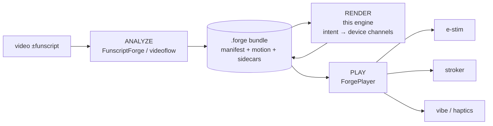

# Forge Container & Player Architecture

> **Status:** design / roadmap. The render engine (motion → intent → device channels) is
> built and tested ([unified-forge.spec.md](unified-forge.spec.md)). The `.forge` container,
> the bundle loader, and the near-real-time player path described here are the forward plan.

## North star

A player (**ForgePlayer**) takes a **video — with or without a funscript** — analyzes it, and
plays it back on **whatever devices the user has** (e-stim, strokers, vibes, haptics) in
**near real time**. Process a clip for a few minutes, then it is fully playable with whatever
hardware is connected.

The enabler is already in the architecture: everything funnels through **one device-agnostic
intent signal**, and device specifics enter only at the final *Polish* step. That is precisely
what lets a player derive *any* device's stream from the same signal at play time — "whatever
you have."

**Reuse edger's concepts, made bigger.** edger's ideas — characters, events, the 1D→2D lift —
are powerful but bound to e-stim/restim today. Routed through the device-agnostic intent layer
they become *reusable primitives any device consumes*: his **characters → device-agnostic Feel
presets**, his **events → Moments** that drive a stroker or a vibe as readily as e-stim, his
**lift → one of several profile renders**. We keep the proven concepts and generalize them from
one device family to all of them.

## Division of labor



| Stage | Owner | Responsibility |
|---|---|---|
| **Analyze** | FunscriptForge / videoflow | video ±funscript → motion + chapters/phrases/beats/audio (the `.forge` bundle). Video analysis lives here, **not** in this engine. |
| **Render** | **this engine** | bundle → 6-dial Feel → device-agnostic intent → per-device channels, safety-clamped. Built today. |
| **Play** | ForgePlayer (orchestrator) + **restim** (e-stim engine) | open the container, sync to video, route each stream to its device. For e-stim, hand the restim-compatible funscripts to **restim** — ForgePlayer does **not** rebuild the signal engine. |

"With or without a funscript": if a stroke funscript exists it is the motion source; if not,
the analyze stage derives `motion.funscript` from the video. Either way the engine sees one
motion track + analysis and renders from it.

**Reuse restim for e-stim playback; don't rebuild it.** The real-time three-phase
audio/electrical signal synthesis — carriers, pulse shaping, the electrical-engineering and
safety subtleties — is restim's job, and restim is **MIT** (reusable with attribution). So
ForgePlayer *embeds/uses restim* for e-stim and we emit **restim-compatible funscripts**
(byte-compatible encoding, verified — spec §7.2/§7.4). We own generation, intent, the
container, and orchestration; we do not reimplement the signal generator. (Our §9 safety
clamps are belt-and-suspenders over restim's own electrode-aware safety calc.)

## The container (`.forge` = a zip, like `.docx`)

A `.forge` document is a **zip structured like an OOXML file** (`.docx`/`.epub`): a manifest
part that indexes everything, plus the data parts.

```text
my_scene.forge   (zip)
├── manifest.ffmeta        # the index: artifacts, roles, timing  (schema ffmeta/v1)
├── motion.funscript       # stroke motion (role=stroke, axis=L0)
├── chapters.json          # boundaries        (at_ms / end_ms)
├── phrases.json           # per-phrase assess metrics (bpm, span, …)
├── beats.json             # beat grid
├── characters.json        # legacy character selections → Feel presets
└── render/                # engine output, per device
    ├── estim/  *.alpha|beta|volume|….funscript
    ├── handy/  *.funscript
    └── …
```

**Why a container, not loose files.** It replaces juggling a dozen separately-synced streams
(video + alpha/beta/volume/pulse_* haptics) with **one self-describing, internally-synced
artifact**. The manifest declares each stream's role and timing, so a player opens one file
with everything aligned — far easier to **stream, distribute, and version** than a loose
multi-funscript folder. The same reason container formats won over loose parts everywhere.

## Near-real-time model — stream, don't pre-render

Playback **streams** the device channels from a small **look-ahead buffer**: the player keeps
a few seconds queued and the engine computes each upcoming window on demand as the playhead
advances. No need to fully render the clip, and no loading 7+ separate files one-per-port — a
single streaming source feeds the player.

This works because per-window compute is tiny: rendering a **5-second window costs ~2 ms in
pure Python (~3000× realtime)**, while a full 93-minute clip is ~2 s — so the look-ahead is
effectively free and the large-file concern disappears (you only ever compute the buffer).
The analysis (`.forge` bundle) is precomputed; only the cheap intent→channel step streams.

Two playback paths (spec §10):

- **External players** → emit the funscript superset → recognized folder → restim/others play
  (the file-based path, for tools that want whole files).
- **ForgePlayer (native)** → read the manifest → **stream** intent→channels per connected
  device from the look-ahead buffer → play in-memory, no funscript surfaced.

Chapter boundaries (spec §7.5) are safe seam points, so streaming can start immediately and
stitch across chapters as it crosses them. *(Engine contract: a windowed render —
`render(t0, t1)` per device — is the streaming primitive; `slice_actions` already isolates a
window, and generation over it is the 2 ms step measured above.)*

## Interoperability matrix

| Direction | Format | Status |
|---|---|---|
| **in** | FunscriptForge `.forge` bundle (manifest + sidecars) | parsers built (chapters, phrases); bundle loader next |
| **in** | edger `config.event_definitions.yml` (events ≈ our Moments) | format researched; mapping designed |
| **out** | restim channel funscripts (alpha/beta/volume/pulse_*) | built (byte-compatible encoding, verified vs restim) |
| **out** | edger event YAML (so it plays in edger's UI) | planned |
| **native** | ForgePlayer in-memory from the `.forge` container | planned |

## What ForgePlayer needs from this engine (contract)

1. **Load** a `.forge` bundle (manifest → motion + sidecars).  *(bundle loader — next build)*
2. **List** available device profiles; render channels **per device** from the one intent
   signal — `generate_estim(...)`, `generate_single_axis(...)` today; more profiles slot in
   as the spec's profile contract (§5), no engine change.
3. **Stream**: per-device channels as time-stamped `{at, pos}` frames the player schedules
   against its master clock; chapter boundaries are safe seam points.
4. **Safety** is always applied as the final render stage (§9) — the player never has to
   re-clamp.

## Status: built vs. planned

- **Built:** motion analysis (§3), Feel derivation (§3.2), e-stim full channel set + lift
  styles + seam stitching (§7), single-axis profiles (§8), safety (§9), chapter sidecar input,
  assess adapter (phrases → Feel). 36 tests.
- **Next:** `manifest.ffmeta` bundle loader (the keystone) → then `.forge` zip container →
  edger event YAML in/out → characters → Feel presets → calibration vs edger output.
